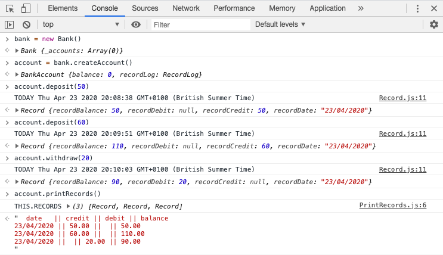

# Bank Tech Test
First Practice Tech Test

Using JS with the Jasmine framework for testing.
Have used ESLint for linting and karma and istanbul for code coverage

## To run
```
git clone git@github.com:WilliamJGrace/bank-tech-test.git
cd bank-tech-test
npm install
open index.html
then open the console and create a bank account using:
bank = new Bank(0)
bankAccount = bank.createAccount()
```
You can then make deposits and withdrawals using:
```
bankAccount.deposit(50)
bankAccount.deposit(90)
bankAccount.withdrawal(20)
```
to see a print out of your statement please type in:
```
bankAccount.printRecords()

```

## To Test and see coverage
```
git clone git@github.com:WilliamJGrace/bank-tech-test.git
cd bank-tech-test
npm test

```

## My approach
I decided to approach this challenge in an Object Oriented manner. I Decided to use a separate class for each responsibility.

## My Structure
The files are separated by Spec and Src. The Spec files contain my tests, the src files contain my classes.




## Specification

### Requirements

* You should be able to interact with your code via a REPL like IRB or the JavaScript console.  (You don't need to implement a command line interface that takes input from STDIN.)
* Deposits, withdrawal.
* Account statement (date, amount, balance) printing.
* Data can be kept in memory (it doesn't need to be stored to a database or anything).

### Acceptance criteria

**Given** a client makes a deposit of 1000 on 10-01-2012  
**And** a deposit of 2000 on 13-01-2012  
**And** a withdrawal of 500 on 14-01-2012  
**When** she prints her bank statement  
**Then** she would see

```
date || credit || debit || balance
14/01/2012 || || 500.00 || 2500.00
13/01/2012 || 2000.00 || || 3000.00
10/01/2012 || 1000.00 || || 1000.00
```
